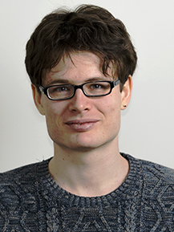

# About me 

I am a linguist working primarily on the grammar of sign languages, specifically Russian Sign Language (RSL) and Sign Language of the Netherlands (NGT). I am most interested in the question to what extent sign languages are similar to and different from spoken languages, that is, in the effects of modality. 

Currently I am a postdoctoral researcher at the University of Amsterdam (ACLC).

On this website, you can find a description of my research projects, and my presentations and publications (with pdfs).

# Contact information 

email: <vadim.kimmelman@gmail.com>

## Postal address

Amsterdam Center for Language and Communication\\
University of Amsterdam\\
Spuistraat 134, 1012VB Amsterdam\\
the Netherlands

# CV

Donwload my [CV](cv kimmelman.pdf) here. 

 

-----

  
